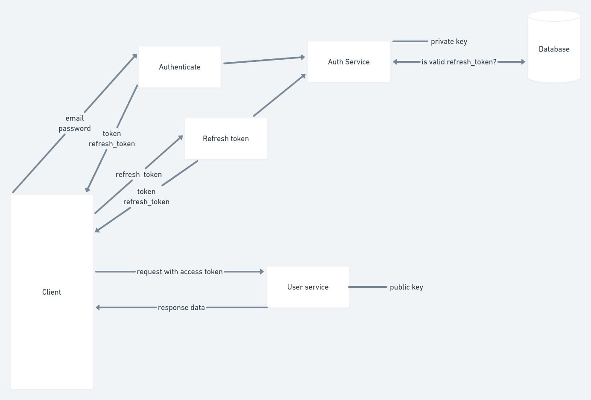

## 🍄 **Sobre**


Este projeto surge na necessidade de possuir um sistema de controle financeiro assim como os milhares que já existem. Entretanto esse projeto visa possuir as funcionalidades adaptadas a minha necessidade, podendo assim ser ajustadas e configuradas da maneira que eu julgar necessária bem como possuir um alto nível de segurança na aplicação, aplicando as boas práticas de desenvolvimento.

Além disso esse projeto é uma forma para eu aprender, aplicar e aprimorar meus conhecimentos técnicos em desenvolvimento, bem como demostrar o mesmo em um projeto razoavelmente grande.

---

## 🧪 **Tecnologias**

Esse projeto foi desenvolvido com as seguintes tecnologias:

- [Node.js](https://nodejs.org/)
- [TypeScript](https://www.typescriptlang.org/)
- [Express](https://expressjs.com/)
- [Prisma](https://www.prisma.io/)
- [Postgresql](https://www.postgresql.org/)

---

## 🎮 **Ambiente de desenvolvimento**

Para executar o ambiente de desenvolvimento deste projeto é necessário possuir o node instalado em sua máquina.

```bash
node --version
v16.0.0
```

Possuir o yarn instalado.

```bash
node --version
1.22.17
```

Para rodar o projeto é necessário rodar um banco PostgreSQL, sugiro o uso do docker e docker-compose. O projeto já contém um arquivo do docker-compose configurado para isso, então basta usar o seguinte comando:


```bash
docker-compose up -d
```

Ou alternativamente configurar o banco manualmente.

Usei o dotenv para variáveis de ambiente, então pode-se renomear o arquivo `.env.example` para `.env` e aproveitar as variáveis de ambiente de lá. Por padrão elas apontam para o banco PostgreSQL do docker-compose.

Crie um arquivo .env com base no arquivo [.env.example](.env.example)

O próximo passo é instalar as dependências:

---

## **🚀 Como executar**

```bash
# Instale as dependências
$ yarn

# Alternativamente instale as dependências exatas do lock file
$ yarn install --frozen-lockfile

# Execute as migrations para criar as tabelas no banco de dados
$ yarn prisma migrate dev

# Execute a aplicação
$ yarn dev
```

- O app estará rodando na porta 3333.
- Acesse [`<http://localhost:3333>`](http://localhost:3333)

---

## 🌊 **Comandos úteis**

<details>

<summary align='center'>Clique para visualizar</summary>

```bash
# start do projeto feito com
$ yarn init -y

# start do prisma
$ yarn prisma init

# run migrations
$ yarn prisma migrate dev

# interface do prisma com o banco de dados
$ yarn prisma studio
```

Comandos para criação de chaves privada e pública (testados no Linux e MacOS).

```bash
# gerar a chave privada 
$ openssl genrsa -out private-key.pem 2048

# gerar a chave pública com base na chave privada
$ openssl rsa -in private-key.pem -pubout -out public-key.pem
```
Para incluir as chaves no `.env` do projeto deverá ser substituido as quebras de linhas por `\n`


</details>

---

## 🏄🏾‍♂️ **JWT**

<details>

<summary align='center'>Clique para visualizar</summary>


O JWT é amplamente utilizado como uma forma de autenticação, porém, se não tivermos o conhecimento necessário e aplicarmos algumas boas práticas, esta forma de autenticação pode ter falhas que comprometem a segurança das nossas aplicações e dos nossos dados.

Refresh tokens são muito importantes quando queremos manter o nível de segurança da nossa aplicação alto, porém sem prejudicar a experiência dos usuários. Eles são usados para que as pessoas continuem "logadas", ou seja, sem precisarem ficar usando usuário e senha muitas vezes, mas ao mesmo tempo mantendo o tempo de expiração dos access tokens baixos.

Neste sentido foi realizado a implementação da autenticação onde é possível gerar um token e um refresh token com expiração e que será passado via cookies httponly. A geração de tokens é feita com o conceito de chave pública e chave privada, pois no momento que precisamos fornecer nossa secret para outros serviços verificar a autenticidade do JWT, aumentamos a chance da nossa secret vazar, tornando-se assim um problema de segurança. Dessa forma o serviço de autenticação irá conter a chave privada e os demais serviços que necessitam verificar o JWT é fornecido a chave pública. 
Também temos endpoints para realizar o refresh token verificando se o mesmo não foi expirado, bem como também possui endpoints para invalidar os refresh tokens no caso de um logout.



</details>

---

## ⚖️ **Licença**

Esse projeto está sob a licença MIT. Veja o arquivo [LICENSE](LICENSE.md) para mais detalhes.

---

Feito com 💜 by Planegazers